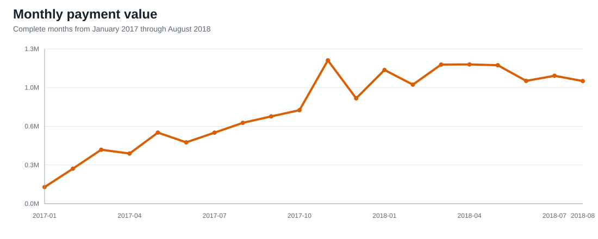
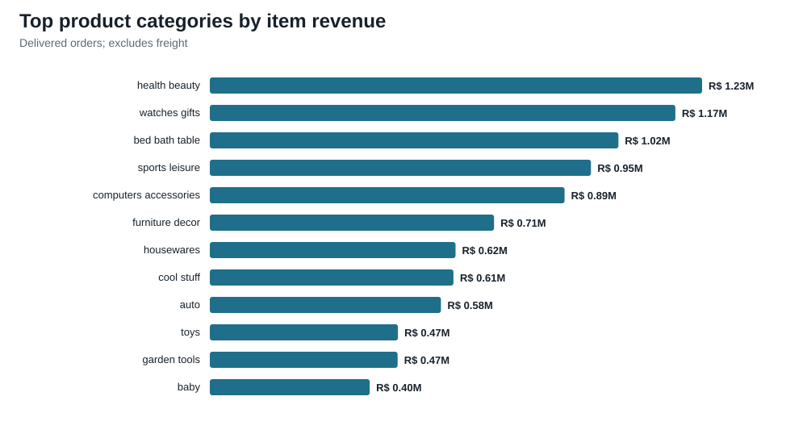
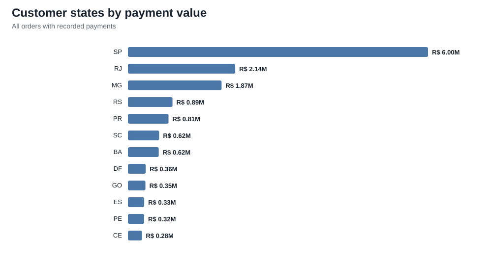
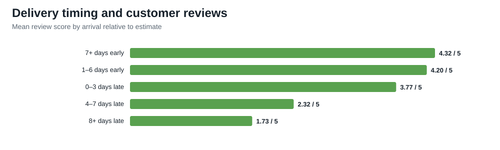
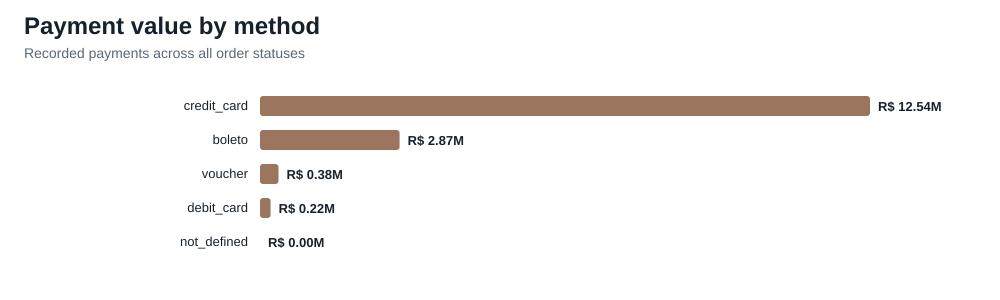

# Detailed analysis

## Executive summary

The dataset contains **99,441 orders** placed by **96,096 identifiable customers** from September 2016 through October 2018. Recorded payments total **R$ 16,008,872**. Because the first and last calendar months are partial, trend comparisons use January 2017 through August 2018.

- Commerce scaled rapidly: payment value in the last six complete months was **2.7×** the first six complete months.
- **97.0%** of orders are marked delivered. Among delivered orders with complete timing data, **91.9%** arrived by the estimated date.
- The median delivered order arrived in **10.2 days**; the 90th percentile was **23.1 days**.
- Reviews are strongly associated with delivery performance: orders at least eight days late averaged **1.73/5**, versus **4.32/5** for orders at least seven days early.
- Repeat purchasing is limited: **2,997 customers (3.1%)** placed more than one order in the dataset.
- Credit cards account for **78.3%** of payment value. The median credit-card installment count is **3**.
- The top category by delivered item revenue is **health beauty** at **R$ 1,233,132**. The top five categories contribute **39.8%** of delivered item revenue.
- São Paulo (SP) contributes **37.5%** of recorded payment value, showing substantial geographic concentration.

## Sales trend



The curve shows sustained growth through the observed complete-month window, with seasonal volatility. Do not treat September and October 2018 as comparable full months because the dataset ends during October and operational timestamps extend beyond the purchase window.

The monthly detail is available in [`monthly_performance.csv`](reports/monthly_performance.csv).

## Product mix



Category revenue uses delivered order items and excludes freight. Categories are translated to English when a mapping exists. Revenue concentration is meaningful but not extreme: the long tail still contributes most delivered item revenue outside the top five categories.

See [`category_performance.csv`](reports/category_performance.csv) for all categories, order counts, units, freight, and average item price.

## Geographic mix



Payment value follows the largest consumer markets, led by São Paulo. State comparisons reflect customer location, not seller location, and do not control for population.

See [`state_performance.csv`](reports/state_performance.csv).

## Delivery and customer experience



Late delivery is associated with sharply lower ratings. This is observational rather than causal: product quality, seller quality, and service recovery may influence both timing and reviews.

See [`delivery_review_relationship.csv`](reports/delivery_review_relationship.csv).

## Payment behavior



Credit cards dominate payment value, followed by boleto. Orders may have multiple payment records, so method-level transaction counts should not be added and interpreted as unique orders without deduplication.

See [`payment_mix.csv`](reports/payment_mix.csv).

## Methodology

- Orders are the base grain for order counts, delivery performance, customer counts, and average order value.
- Item revenue is the sum of `price`; freight is reported separately.
- Payment value is aggregated to one row per order before joining to prevent many-to-many inflation.
- Multiple reviews for an order are averaged before joining.
- A customer means `customer_unique_id`; `customer_id` is order-specific in this dataset.
- On-time means `order_delivered_customer_date <= order_estimated_delivery_date`.
- Trend charts exclude incomplete edge months and use January 2017 through August 2018.
- Raw rows and identifiers are not committed to Git. Generated reports contain aggregates only.

## Limitations

- The data covers orders placed on Olist in Brazil during the observed period; it is not a complete view of Brazilian e-commerce.
- Revenue figures are nominal Brazilian reais and are not adjusted for inflation, refunds, or marketplace fees.
- Recorded payment value and item-plus-freight totals can differ because of vouchers, multi-method payments, or data lifecycle effects.
- Review relationships are descriptive and should not be read as experimental causal estimates.
- The dataset includes partial first and last months and a small number of non-delivered orders.

## Reproduce

```powershell
python -m pip install kaggle pandas numpy
./scripts/download-data.ps1
python ./analysis/analyze.py
```

Source: [Brazilian E-Commerce Public Dataset by Olist on Kaggle](https://www.kaggle.com/datasets/olistbr/brazilian-ecommerce). Check the Kaggle page for current license and usage terms.
