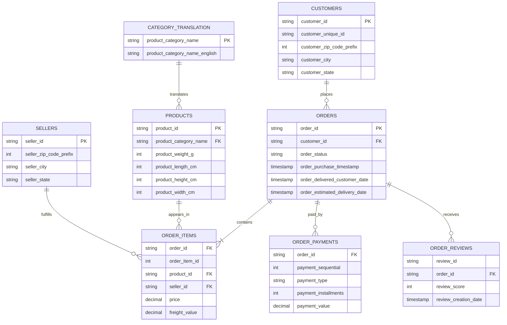

# Entity-relationship diagram

`customer_id` identifies the customer record attached to an order.
`customer_unique_id` should be used to count people and repeat purchases.
Geolocation is intentionally not joined directly because ZIP-prefix rows are
not unique; aggregate them to one coordinate per prefix before use.
